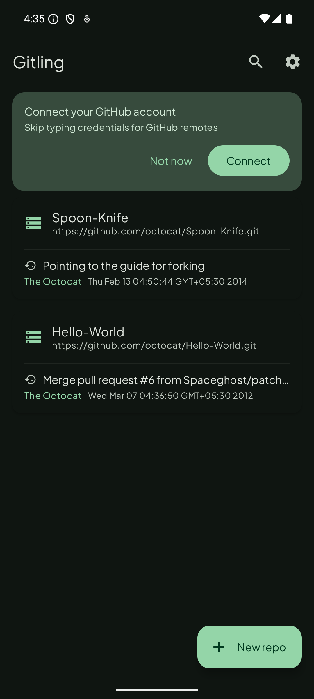
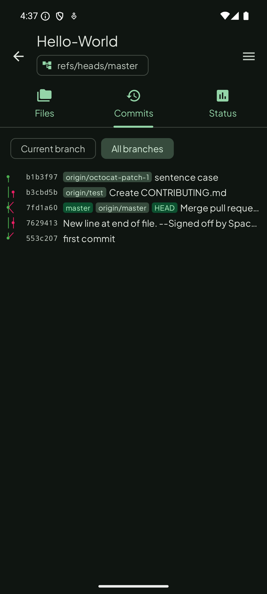
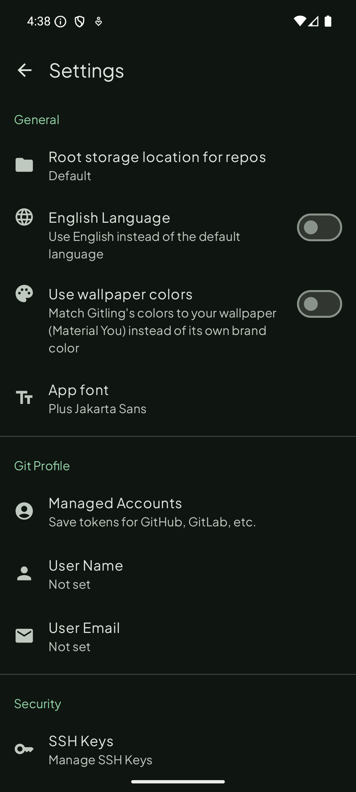
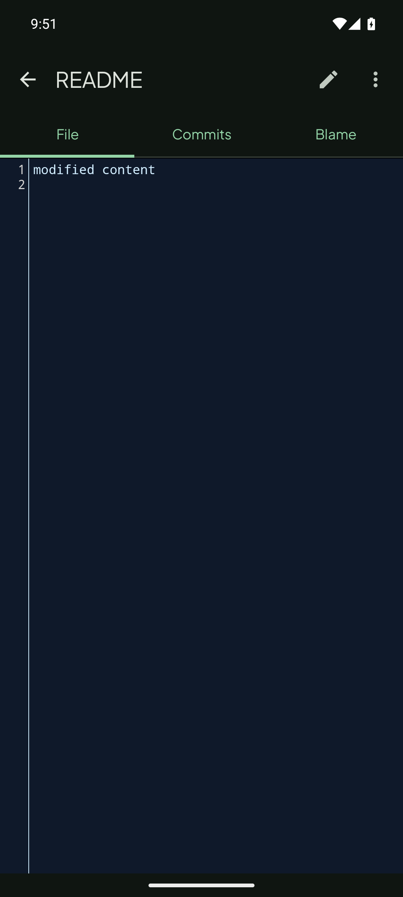
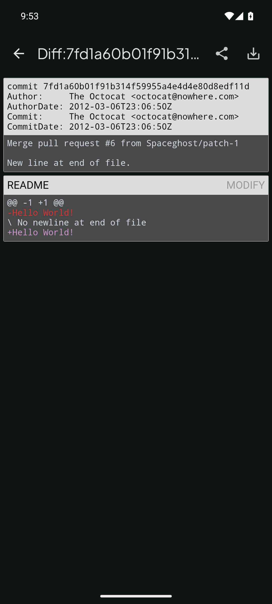

  

<h1 align="center">Gitling</h1>

  
  
  

Gitling is a Git client for Android, built with Jetpack Compose and Material 3 Expressive.

It's a fork of [MGit](https://github.com/maks/MGit) (itself a continuation of [SGit](https://github.com/sheimi/SGit)), modernized with a current Android toolchain, a from-scratch Compose UI, one-tap GitHub sign-in, and a new identity.

* If you encounter any issues (bugs, crashes, etc.), please open an issue on [GitHub](https://github.com/maneeshacooray/Gitling/issues/new) describing what happened and how to reproduce it.
* This app requires a minimum of Android 6.0 (API 23).

## Screenshots

<table>
  <tr>
    <td></td>
    <td></td>
    <td></td>
  </tr>
  <tr>
    <td align="center">Repository list</td>
    <td align="center">Full branch/merge commit graph</td>
    <td align="center">Settings</td>
  </tr>
  <tr>
    <td></td>
    <td></td>
  </tr>
  <tr>
    <td align="center">File viewer with syntax highlighting</td>
    <td align="center">Commit diff view</td>
  </tr>
</table>

### Editing files

Gitling doesn't include an internal text editor -- to edit files, you'll need an editor app installed that supports opening files via Android's File Provider mechanism (most code/text editor apps do).

## Features

* Clone, create, and delete local repositories
* One-tap **Connect with GitHub** (OAuth Device Flow) -- no manual token/password handling for GitHub remotes
* HTTP/HTTPS/SSH, including SSH with private-key passphrase
* Username/password and personal access token authentication for any Git host
* Browse files and commit history, `git diff` between commits
* Checkout, create, and merge local/remote branches and tags
* `git status`, staging, `git rebase`, `git cherry-pick`, `git checkout <file>`
* Private key generation and management
* Import an existing repository from device storage
* Light/dark mode that follows the system, with a choice between a fixed brand color or wallpaper-based Material You dynamic color

## Quick start

### Clone a remote repository

1. Tap the `+` button to add a new repository
2. Enter the remote URL (see formats below)
3. Enter a local repository name -- this is **not** the full path; Gitling stores all repositories under a common root directory (changeable in Settings)
4. Tap `Clone`
5. If required, you'll be prompted for credentials -- or connect your GitHub account once in Settings to skip this for GitHub remotes

### Create a local repository

1. Tap the `+` button to add a new repository
2. Choose `Init Local` to create a local repository
3. Enter a name when prompted

### URL formats

**SSH**
* Standard port (22): `ssh://username@server_name/path/to/repo`
* Non-standard port: `ssh://username@server_name:port/path/to/repo`
* A username is required.

**HTTP(S)**
* `https://server_name/path/to/repo`

## License

GPLv3 -- see [LICENSE](./LICENSE).

This project is a fork of [maks/MGit](https://github.com/maks/MGit), itself a fork of [sheimi/SGit](https://github.com/sheimi/SGit). Credit to both for the original implementation this continues to build on.

### Third-party fonts

The app's default typeface, [Plus Jakarta Sans](https://github.com/tokotype/PlusJakartaSans), is licensed under the [SIL Open Font License 1.1](https://scripts.sil.org/OFL). Settings > App font also offers [Inter](https://github.com/rsms/inter) and [JetBrains Mono](https://github.com/JetBrains/JetBrainsMono) as alternatives, both also OFL-1.1.
